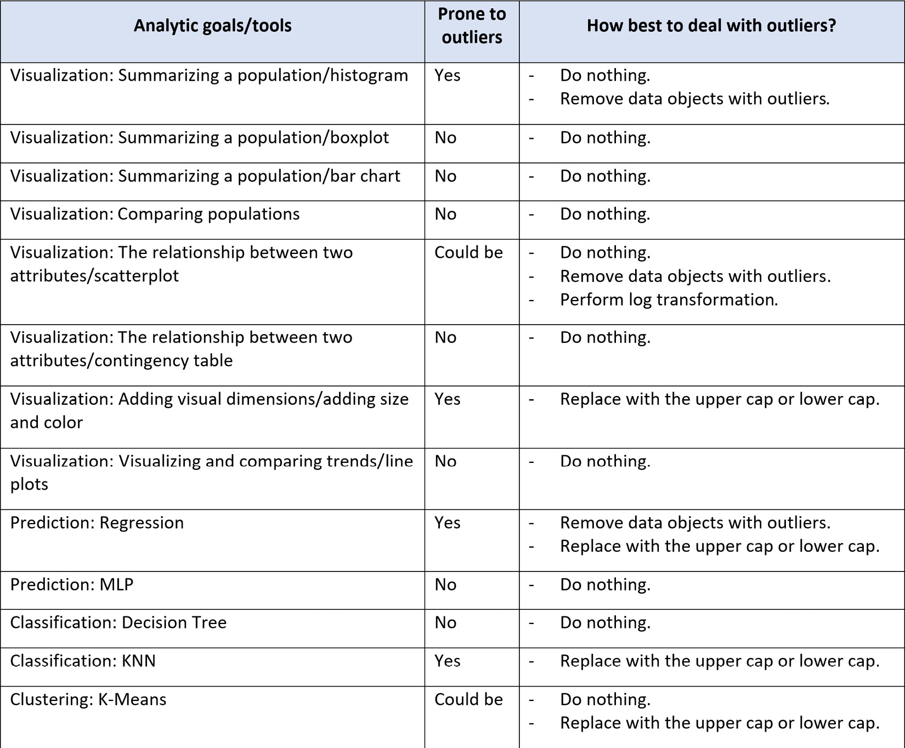

# Preprocesamiento de datos

## Datos faltantes

- Ciertos algoritmos no pueden funcionar cuando el valor faltante está presente.
- Incluso para algoritmos que manejan datos faltantes, sin tratamiento, el modelo puede llevar a una conclusión inexacta

### Mecanismos de faltantes

- Falta completamente al azar (Missing Completely At Random - MCAR)
    - Significa que la falta de datos no está relacionada ni con el valor específico que se supone que se obtiene ni con el conjunto de respuestas observadas. Por ejemplo, imagina un conjunto de datos creado a partir de respuestas de encuestas para la satisfacción del cliente. Estos tipos de preguntas suelen ser opcionales. Si tuvieras que separar los resultados de las respuestas completas de las respuestas faltantes, es posible que observes que estos dos grupos no tienen correlación con las edades de los clientes. Cada cliente simplemente eligió omitir una o más preguntas al azar. La ventaja de los datos que son MCAR es que los resultados del análisis permanecen imparciales.

- Falta al azar (Missing At Random - MAR)
    - Significa que la razón por la que falta la variable no está relacionada con su valor subyacente, sino que depende de otras variables. Por ejemplo, si es más probable que los hombres revelen su peso que las mujeres, el peso es MAR (en la variable sexo). La información del peso faltará al azar para aquellos hombres y mujeres que decidieron no revelar su peso, pero como los hombres son más propensos a revelarlo, habrá más valores perdidos para las mujeres que para los hombres. En la mayoría de los casos, podemos suponer que MAR no presenta un problema ya que se produce al azar, por lo tanto, no está sesgado.

- Falta no al azar (Missing Not at Random - MNAR)
    - Significa que la razón por la que falta la variable está relacionada con el valor de la variable en sí. Por ejemplo, si tu encuesta ahora le pregunta a las personas sobre sus ingresos, puede haber una mayor probabilidad de que las personas con salarios más altos no quieran revelar sus ingresos, lo que significa que podrían simplemente omitir la pregunta. En este caso, faltan los datos debido a los mismos valores que estás tratando de recopilar. Esta es la categoría más difícil, ya que el manejo incorrecto de estos datos faltantes podría generar un fuerte sesgo en los resultados.

- ¿Cómo asumir un mecanismo faltante?
    Por entendimiento de negocios. En muchas situaciones, podemos asumir el mecanismo investigando la lógica comercial detrás de esa variable.
    Por prueba estadística. Se divide el conjunto de datos en dos: con/sin faltantes y se realiza una prueba t para ver si hay diferencias significativas. Si las hay, podemos suponer que la falta no se completa al azar (no es MCAR).

## Valores atípicos

-  valor atípico es una observación que se desvía tanto de las otras observaciones como para despertar sospechas de que fue generada por un mecanismo diferente.
- La presencia de valores atípicos puede:
    - Hacer que el algoritmo no funcione correctamente
    - Introducir ruidos en el conjunto de datos
    - Hacer las muestras menos representativas

### Métodos para la detección de atípicos
- Límite arbitrario: Identificar valores atípicos basados en límites arbitrarios (requiere entendimiento del negocio).
- Media y desviación estándar: Detección de valores atípicos mediante el método media y desviación estándar.
- Método IQR: Detección de valores atípicos mediante la regla de rangos intercuartílicos.

## Alta cardinalidad
- El número de etiquetas dentro de una variable categórica se conoce como cardinalidad. Un alto número de etiquetas dentro de una variable se conoce como alta cardinalidad.
- Las variables con demasiadas etiquetas tienden a dominar sobre aquellas con solo unas pocas etiquetas.
- Una gran cantidad de etiquetas dentro de una variable puede introducir ruido con poca o ninguna información, lo que hace que los modelos de aprendizaje automático sean propensos a overfit.
- Es posible que algunas de las etiquetas sólo estén presentes en el conjunto de datos de entrenamiento, pero no en el conjunto de prueba, lo que provoca que los algoritmos se ajusten en exceso al conjunto de entrenamiento.

### ¿Cómo lidiar con la alta cardinalidad?
- Agrupación de categorías con conocimiento empresarial. Por ejemplo, en lugar de ocupar los datos por país, agruparlos por región.
- Agrupación de categorías con poca ocurrencia en una categoría única. Por ejemplo, si se analiza la ocurrencia de ciertas enfermedades, todas aquellas que tengan prevalencia mínima, podrían agruparse en la categoría “Otras”

## Jafari, R. (2022). Hands-On Data Preprocessing in Python. Packt Publishing. - Missing values
- Missing values, as the name suggests, are values we expect to have but we don't. In the simplest terms, missing values are empty cells in a dataset that we want to use for analytic goals.
- We now know what missing values are and how they are presented in our analytic environment of choice, Python. Unfortunately, missing values are not always presented in a standard way; for example, having NaN on a pandas DataFrame is a standard way of presenting missing values. However, someone who did not know any better may have used some internal agreements to present missing values with an alternative such as MV, None, 99999, and N/A. If missing values are not presented in a standard way, the first step of dealing with them is to rectify that. In such cases, we detect the values that the author of the dataset meant as missing values and replace them with np.nan.
- Detecting missing values. Every Pandas DataFrame comes with two functions that are very useful in detecting which attributes have missing values and how many there are: .info() and .isna(). The following example shows how these functions can be used to detect whether a dataset has missing values and how many values are missing.
- first method:  .info()
- A second method to figure out which attributes have missing values is to use the .isnan() function of Pandas Series. Both Pandas DataFrames and Pandas Series have the .isnan() function

### Causes of missing values
- There can be a wide range of reasons as to why missing values may occur. As we will see in this chapter, knowing why a value is missing is the most important piece of information that enables us to handle missing values effectively
- Human error.
- Respondents may refuse to answer a survey question.
- The person taking the survey does not understand the question.
- The provided value is an obvious error, so it was deleted.
- Not enough time to respond to questions.
- Lost records due to lack of effective database management.
- Intentional deletion and skipping of data collection (probably with fraudulent intent).
- Participant exiting in the middle of the study.
- Third-party tampering with or blocking data collection.
- Missed observations.
- Sensor malfunctions.
- Programing bugs.

- Committing the preceding list to memory and understanding these reasons will be beneficial to you when you have to guess what could have caused missing values.
- Regardless of what caused missing values, from a data analytic perspective, we can categorize all the missing values into three types. Understanding these types will be very important in deciding how missing values should be addressed.

### Types of missing values
- missing completely at random (MCAR)
    - MCAR is used when we do not have any reason to believe the values are missing due to any systematic reasons. When a missing value is classed as MCAR, the data object that has a missing value could be any of the data objects.
- missing at random (MAR)
    -  MAR when some data objects in the data are more likely to have missing values. For instance, if a high wind speed sometimes causes a sensor to malfunction and renders it unable to give a reading, the missing values that have happened in the high wind are classed as MAR. The key to understanding MAR is that the systematic reason that leads to having missing values does not always cause missing values but increases the tendency of the data objects to have missing values.
- missing not at random (MNAR).
    - MNAR happens when we know exactly which data object will have missing values. For instance, if a power plant that tends to emit too much air pollutant tampers with the sensor to avoid paying a penalty to the government, the data objects that are not collected due to this situation would be classed as MNAR. MNAR missing values are the most problematic ones, and figuring out why they happen and stopping them from happening is often the priority of a data analytic project.

### Diagnosis of missing values
- An attribute with missing values has, in fact, the information of two variables: itself, and a hidden attribute. 
- The hidden attribute is a binary attribute whose value is one when there is a missing value, and zero otherwise. 
- All we need to do is to investigate whether there is a relationship between the hidden binary variable of the attribute with missing values and the other attributes in the dataset.
- MCAR: We don't expect the hidden binary variable to have a meaningful relationship with the other attributes.
- MAR: We expect a meaningful relationship between the hidden binary variable and at least one of the other attributes.
- MNAR: We expect a strong relationship between the hidden binary variable and at least one of the other attributes.

- Compare using histogram, boxplot, t-test

- WHAT IS A P-VALUE?

    - This is the second time we are seeing the concept of a p-value in this chapter. A p-value is the same concept across all statistical tests and it has the same meaning. Every statistical test hypothesizes something (which is called a null hypothesis), and the p-value is calculated based on this hypothesis and the observations (data). The p-value is the probability that the data that has already happened is happening if the null hypothesis is true.

## McKinney, W. (2022). Python for Data Analysis (3rd ed.). O´Reilly Media.

- 7.1 Handling Missing Data
    - Missing data occurs commonly in many data analysis applications. One of the goals of pandas is to make working with missing data as painless as possible. For example, all of the descriptive statistics on pandas objects exclude missing data by default.
- Functions like pandas.isna abstract away many of the annoying details.
- Functions for dropping na, filling na, imputing, etc.

## Jafari, R. (2022). Hands-On Data Preprocessing in Python. Packt Publishing. - Outliers
- Outliers, a.k.a. extreme points, are data objects whose values are too different than the rest of the population. Being able to recognize and deal with them is important from the following three perspectives:
- Outliers may be data errors in data and should be detected and removed.
- Outliers that are not errors can skew the results of analytic tools that are sensitive to the existence of outliers.
- Outliers may be fraudulent entries.

### Detecting outliers
- The tools we use for detecting outliers depend on the number of attributes involved. If we are interested in detecting outliers only based on one attribute, we call that univariate outlier detection; if we want to detect them based on two attributes, we call that bivariate outlier detection; and finally, if we want to detect outliers based on more than two attributes, we call that multivariate outlier detection. 

#### Univariate outlier detection

#### Bivariate outlier detection

### Dealing with outliers
- 

- When we have detected outliers in a dataset we want to analyze, we also need to effectively deal with outliers. The following list highlights the four approaches we can use to deal with outliers:

#### Do nothing
- do nothing is the best strategy in most analytic situations. The reason for this is that most analytic tools we use can easily handle outliers. In fact, if you know the analytic tools you want to use can handle outliers, you might not perform outlier detection in the first place. However, outlier detection itself may be the analytic you need, or the analytic tool you need to use is prone to outliers.
#### Replace with the upper cap or lower cap
- Do it when:
    - The outlier is univariate.
    - The analytic goals and/or tools are sensitive to outliers.
    - We do not want to lose information by removing data objects.
    - An abrupt change of value will not lead to a significant change in the analytic conclusions.
- If the criteria are met, in this approach the outliers are replaced with the correct upper or lower cap. The upper and lower caps are statistical concepts we discussed earlier in this chapter in the Univariate outlier detection section. They are also an essential part of any boxplot. We replace the univariate outliers that are too much smaller than the rest of the data object with the lower cap of the Q1-1.5*IQR attribute, and replace the univariate outliers that are too much larger than the rest of the data objects with the upper cap of the Q3+1.5*IQR attribute.
#### Perform a log transformation
- As a method to deal with outlier detection, it is only applicable in certain situations. When an attribute follows an exponential distribution, it is only typical for some of the data objects to be very different from the rest of the population. In those situations, applying a log transformation will be the best approach.
#### Remove data objects with outliers
- This is our least favorite approach and should only be used when absolutely necessary. The reason that we would like to avoid this approach is that the data is not incorrect; the values of the outliers are correct but happen to be too different from the rest of the population
- First, only apply this approach to the preprocessed version of the dataset that you've created for the specific analysis and not to the source data. The fact that this analysis needed the data objects with outliers to be removed does not mean all the analysis will need that. Second, make it a priority to inform the audience of the resulting analytic as they will be aware of this invasive approach in dealing with outliers.